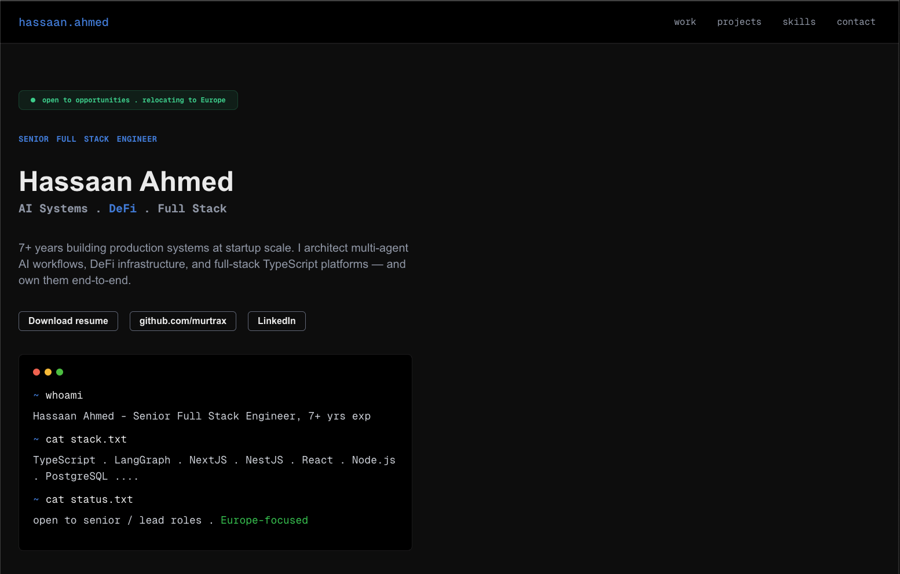
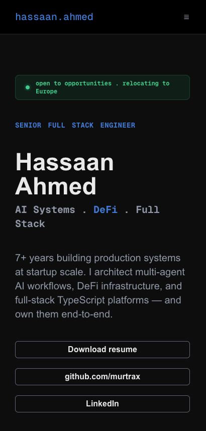

# Hassaan Ahmed — Personal Site

A small personal portfolio built with Next.js, TypeScript, and Tailwind CSS.

It includes an animated terminal intro, work experience, featured projects, skills, contact links, and a downloadable resume.

## Preview

### Desktop



### Mobile



## Run Locally

```bash
yarn install
yarn dev
```

Then open:

```txt
http://localhost:3000
```

## Scripts

```bash
yarn dev
yarn build
yarn start
yarn lint
```

## Structure

```txt
app/                  App Router files and global styles
components/sections/  Main page sections
components/ui/        Reusable UI pieces
utils/constants.tsx   Site content
utils/types.ts        Shared TypeScript types
public/               Static assets and resume PDF
```

Most text, links, project data, skills, and contact info live in `utils/constants.tsx`.
